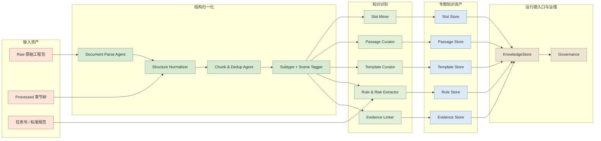
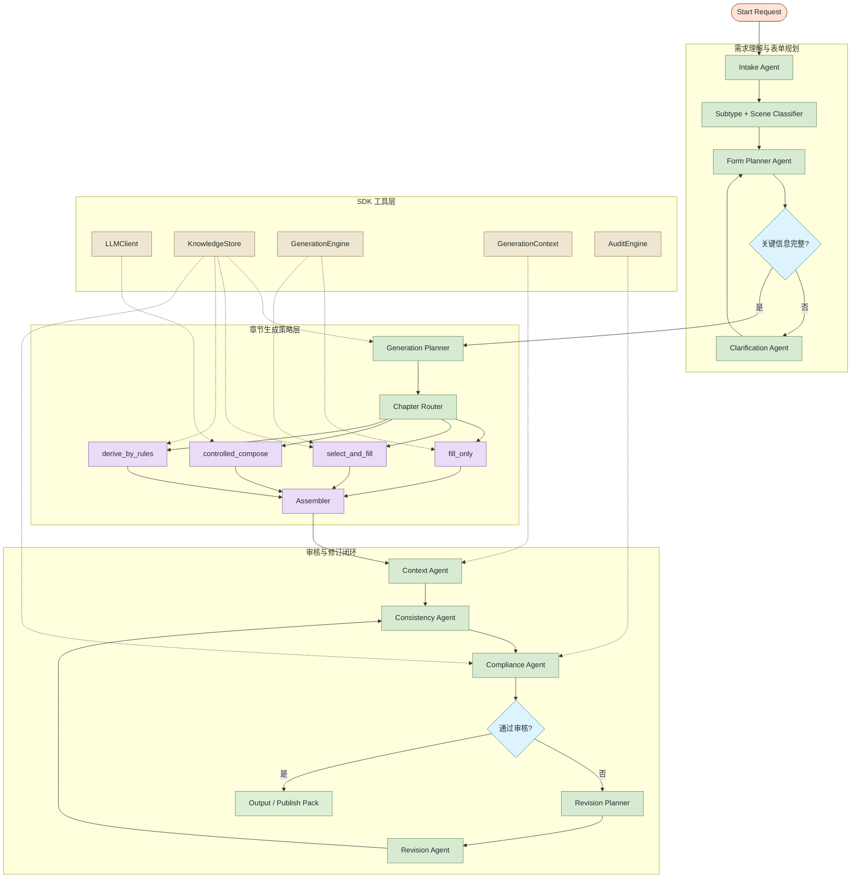

# 线路工程施工方案 Agent 架构图说明

本文档由 `scripts/render_agent_architecture.py` 生成，用于团队内部对齐当前 Agent 规划，不代表已进入实现阶段。

本地查看交互图时，优先打开：

- `knowledge_construction_interactive.html`
- `agent_runtime_interactive.html`

脚本会优先调用 Mermaid CLI 生成本地 SVG，并把 SVG 直接嵌入 HTML，避免浏览器端 Mermaid 渲染失败后只显示源码。

## 当前范围

- 知识页更接近终态知识层，已经显式补出 `Template Curator / Template Store`，并把多标签子类型与工况识别纳入主链。
- Agent 页当前只覆盖“编制 + 审核”主链，不把动态管控 / 现场协同画进主图；相关终态衔接通过卡片与本说明文档表达。

## 目标判断

结合任务计划书、Formal Version 数据和 SDK 工具层，系统目标不应被理解为“完全开放式自由写作”。更准确的目标是：围绕线路工程施工方案，把历史方案与规范沉淀为以下五类知识资产，再由 Agent 在受控边界内调用它们完成编制与审核：

- 模板固定内容
- 预置可选段落
- 关键参数槽
- 规则 / 风险检查点
- 证据索引

正式版数据中的五种子类型 `基础 / 架线 / 跨越 / 立塔 / 消缺` 应作为运行期和知识层的一等标签。`Formal_Version_Data_Processed` 更适合作为主建库输入，因为它已经整理成章节树 JSON，并区分 `text / table / image`；`Formal_Version_Data_Raw` 更适合作为证据底座、补充抽取源和外部审核输入源。

## 知识构建层

## Agent 主链

